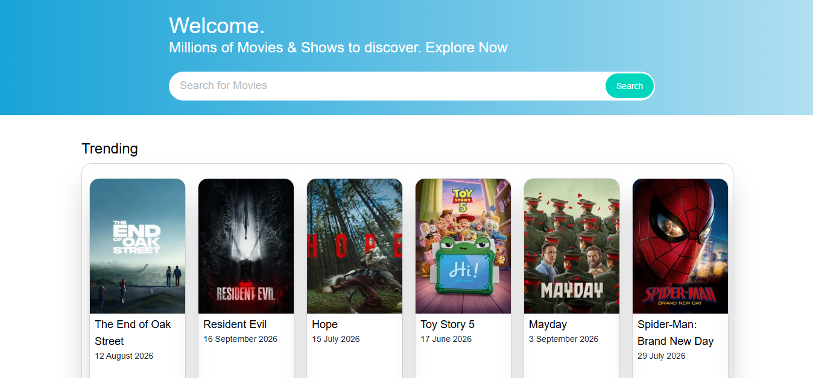

# 🎬 CineVerse — React Movie App

A modern and responsive movie discovery web application built with **React.js** and the **TMDB API**. Explore popular movies, search for films, view detailed information, discover cast members, and explore actor profiles.

## 🚀 Live Demo

🔗 **[View Live Demo](#)**

> Replace the `#` with your deployed project URL.

## 📸 Preview



## ✨ Features

* 🎬 Browse popular movies
* 🔎 Search for movies
* ⭐ View movie ratings
* 📅 View release dates
* 📖 Read movie overviews
* 🎭 Explore movie cast
* 👤 View actor profiles
* 🎞️ Explore an actor's movies
* 📱 Fully responsive design
* 🌙 Dark movie-themed interface
* ⚡ Fast and dynamic UI with React
* 🔗 Movie and actor pages using dynamic routes

## 🛠️ Technologies Used

* **React.js**
* **JavaScript**
* **Tailwind CSS**
* **TMDB API**
* **Vite**
* **React Router**
* **Git & GitHub**

## 📂 Project Structure

```text
react-movie-app/
│
├── public/
│
├── src/
│   ├── assets/
│   ├── components/
│   ├── pages/
│   ├── App.jsx
│   ├── main.jsx
│   └── index.css
│
├── .gitignore
├── index.html
├── package.json
├── package-lock.json
├── vite.config.js
└── README.md
```

## 📱 Responsive Design

The application is designed to work across:

* 📱 Mobile devices
* 📲 Tablets
* 💻 Laptops
* 🖥️ Desktop screens

## 🎯 What I Learned

While building this project, I practiced:

* Building reusable React components
* React state management with `useState`
* Fetching API data
* Working with asynchronous JavaScript
* Using `async/await`
* Handling API responses
* React Router and dynamic routes
* Working with URL parameters
* Responsive design with Tailwind CSS
* Creating movie and actor detail pages
* Working with nested API data
* Managing loading and error states

## 🔮 Future Improvements

* 🎥 Add movie trailers
* ❤️ Add a favorites/watchlist feature
* 🔐 Add user authentication
* 🎯 Add genre-based filtering
* 🔥 Add trending movies
* 🎭 Add more detailed actor information
* 💾 Store user watchlists
* 🔔 Add notifications for new releases

## 👨‍💻 Author

**Hemant Kumar**

I'm currently learning **Frontend Development with React.js** and building projects to improve my practical development skills.

## 📄 License

This project is created for **learning and portfolio purposes**.

Movie data and images are provided by **TMDB**.

---

⭐ If you found this project interesting, consider giving the repository a star!
